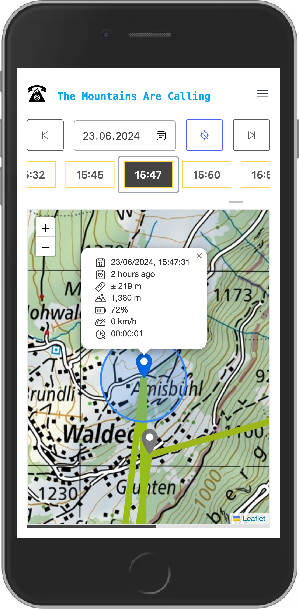

# The mountains are calling

## Idea

Based on the idea of *simple*, location sharing first introduced in [Google Latitude](https://en.wikipedia.org/wiki/Google_Latitude), and then expanded in various other projects [1](https://support.strava.com/hc/en-us/articles/224357527-Strava-Beacon), [2](https://support.strava.com/hc/en-us/articles/207294450-Strava-Beacon-for-Garmin) this app is here for outdoor enthusiasts that want to:

- Give themselves peace of mind by _not_ requiring to remember to enable live tracking. It can _optionally_ be _always on_.
- Having complete control over your data:
  - The dataset gathered is minimal to allow full functionality & prevent any spying.
  - No registration, login or any other [PII](https://en.wikipedia.org/wiki/Personal_data)s are required.
  - No app installation necessary.
  - Although the default setup shares the location data to **our servers**, the project is fully [Open Source](https://en.wikipedia.org/wiki/Open_source) with detailed manual on how to self host. So you can have the data completely under control.

## Demo

[https://the-mountains-are-calling.netlify.app/](https://the-mountains-are-calling.netlify.app/)

## Screenshots

## Functionality

- Allows audit of location history of a device.
  - This person went to the mountains and is not responding. What was their last known location? Where were they heading to? What is the expected location where they might be?
  - Their phone disappeared from the network for some time, did it come back online?
  - What is the accuracy of given data point?
- Shows last known location of a device.
  - When was the last time location data were shared?
  - What is the accuracy of last known location point?
- Is not useable for spying on people.
  - There is no direct functionality that shares live location data, only (location) data gathering and analysis. Given device has to intentionally send the data to the service. If your device already shares information about your position to other parties without your consent, then you have different kind of problems.
  - The app only works with minimum necessary data to provide useful information. See "Data" section.

## Quickstart

> [!CAUTION]
> This part of the README is intended to show a way to get **started quickly**. With this setup your `Device` will **share location data** with 3rd party `Provider`, which is controlled by us. And then we will be able to read your data. If you're looking for privacy focused solution, follow the guide on one of the providers.

### Device
1. Install [Automate from LlamaLab](https://play.google.com/store/apps/details?id=com.llamalab.automate).
2. Download and install [The Mountains Are Calling flow](docs/providers/The%20Mountains%20Are%20Calling.flo).
3. Run the flow.
   1. On first run the flow generates an **unique** `Provider URL` where the data will be stored. Last part of the URL is [uuid4](https://llamalab.com/automate/doc/function/uuid4.html) pseudo-random string which is also called `DeviceId`.
   2. It will show you the value via input dialog.
   3. Copy the the value somewhere else and share it with `Client`. In case you lose it, just re-run the flow and the same dialog will appear again.
   4. You don't need to change anything, just confirm.

## Client
1. Go to: https://the-mountains-are-calling.netlify.app/
2. Click on `Settings`
3. Fill in the `Provider URL` you got in previous step
4. Click on `Map`
5. Search for a date when the `Device` was sharing location.

## Terminology

### Device

Device is any electronic instrument that can:

1. Collect information about it's current GPS location.
2. Has a knowledge about current time.
3. Is able to share that information over HTTP request.

Here device is the item whose location is being tracked.

### Provider

A provider is a server that gathers location data from `Devices` and then provides (hence the name) them to `Clients`.

The application can, in theory, work using any technology as a `Provider`. Firebase instance, Box folder, MongoDb instance, ...

Currently implemented providers are:

- [Firebase Realtime Database](docs/providers/firebase.md)

### Client

Client is the visualisation part of the system. Currently implemented as a simple web application. Even the hosted application does not track or collect any of your data, but if your want to feel more safe, you can build and deploy it on any webserver that can host static assets. For example: [netlify](https://www.netlify.com/blog/2016/09/29/a-step-by-step-guide-deploying-on-netlify/).

## Data

- `latitude: number` - Location GPS latitude [degrees]
- `longitude: number` - Location GPS longitude [degrees]
- `accuracy: number` - How precise is the location information [meters]
- `timestamp: number` - When was the GPS location obtained [unix timestamp]

## Name

> The mountains are calling and I must go.
>
> -- <cite>[John Muir](https://en.wikiquote.org/wiki/John_Muir) - letter to sister Sarah Muir Galloway (3 September 1873)</cite>
